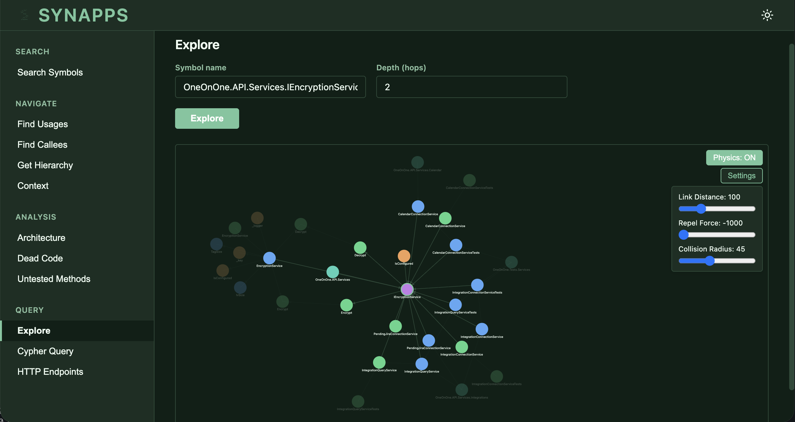

<p align="center">
  
</p>

# Synapps

[](https://github.com/SynappsCodeComprehension/synapps/actions/workflows/ci.yml)
[](https://www.python.org/downloads/)
[](LICENSE)

**Give your AI agent a deep understanding of your codebase — not just files and symbols, but the relationships between them.**

Synapps is an MCP server and CLI that builds a queryable graph of your codebase using Language Server Protocol analysis. It indexes symbols, call chains, inheritance trees, interface implementations, and type dependencies across C#, Python, TypeScript/JavaScript, and Java projects — then lets AI agents (or humans) query that graph to make safer, faster, better-informed code changes.

## Why Synapps

AI agents working with code today rely on grep and file reads. That works for simple lookups, but falls apart when the question is *"what happens if I change this?"* — when the answer depends on call chains, interface dispatch, inheritance, and test coverage spanning dozens of files.

Synapps gives your agent a compiler-grade understanding of how code connects, without reading every file.

| Without Synapps | With Synapps |
|---|---|
| Grep for `.DoWork(` across the codebase, filter false positives manually | `find_usages("DoWork")` — precise results, including calls through interfaces |
| Read 5+ files to understand a method before editing | `get_context_for("X", scope="edit")` — source, callers, dependencies, and test coverage in one call |
| Hope you found every caller before refactoring | `get_context_for("X", scope="impact")` — structured impact report with test coverage |
| Manually trace from a method to its API endpoint | `find_entry_points("X")` — automatic root-caller discovery |
| Guess which tests cover a method | `find_tests_for` — direct test→method lookup via TESTS edges *(experimental)* |
| Check test coverage gaps across the codebase | `find_untested` — production methods with no test coverage *(experimental)* |
| Skim dozens of files to understand a new codebase | `get_architecture` — packages, hotspot methods, HTTP service map, and stats in one call |
| Manually audit for unused methods | `find_dead_code` — methods with zero callers, false positives filtered out *(experimental)* |

## Quick Start

```bash
pip install synapps-mcp
synapps init
```

`synapps init` walks you through setup:
1. **Detects languages** in your project (C#, Python, TypeScript, Java)
2. **Checks prerequisites** — Docker, Memgraph, and language servers for detected languages only
3. **Shows fix commands** for anything missing (platform-specific: `brew` on macOS, `apt` on Linux)
4. **Indexes your project** — builds the code graph automatically
5. **Configures your MCP client** — detects Claude Desktop, Claude Code, Cursor, or Copilot and offers to write the config
6. **Installs pre-tool hooks** — optional advisory hooks that remind agents to use graph tools before falling back to grep/file search (Claude Code, Cursor, GitHub Copilot)

After init completes, your AI agent can use Synapps tools immediately.

For development from source: `pip install -e .`

### Prerequisites

- **Python 3.11+**
- **Docker** — Synapps auto-manages Memgraph containers. Not required when connecting to an external Memgraph instance.
- **Language servers** (only for languages in your project):
  - C#: .NET SDK (Roslyn Language Server is auto-downloaded on first index)
  - Python: Pyright (`npm install -g pyright`)
  - TypeScript/JavaScript: `npm install -g typescript-language-server typescript`
  - Java: Eclipse JDTLS (auto-managed)

Run `synapps doctor` to check your environment.

### Manual MCP Configuration

`synapps init` handles this automatically. To configure manually:

**Claude Desktop** / **Claude Code** / **Cursor**:

```json
{
  "mcpServers": {
    "synapps": {
      "command": "synapps-mcp"
    }
  }
}
```

Config file locations: Claude Desktop (`claude_desktop_config.json`), Claude Code (`.mcp.json`), Cursor (`~/.cursor/mcp.json`).

**VS Code / GitHub Copilot** (`.vscode/mcp.json`):

```json
{
  "servers": {
    "synapps": {
      "command": "synapps-mcp"
    }
  }
}
```

---

## Features

### Deep Call Graph

Synapps uses a two-phase indexing approach: LSP extracts structural symbols (classes, methods, properties), then tree-sitter finds call sites and LSP resolves what each call points to. The result is a graph of CALLS edges between methods — not string matches, but semantically resolved references.

This means your agent can follow a method call through 6 levels of indirection and know exactly what code is reachable, without reading a single file.

**Tools:** `find_usages`, `find_callees` (with `depth` for call trees), `find_entry_points`

### Interface Dispatch Resolution

In dependency-injected codebases, `service.Process()` could mean any of 5 concrete implementations. Grep finds the interface method. Synapps finds the interface method *and* every concrete implementation, automatically.

**Tools:** `find_usages`, `find_implementations`

### Impact Analysis

Before your agent changes a method, it should know: how many places call it, whether tests cover it, and what it depends on. `analyze_change_impact` answers all three in a single, token-efficient response — categorized into direct callers, transitive callers, test coverage, and downstream callees.

**Tools:** `get_context_for` (with `scope="impact"`), `find_usages` (with `include_test_breakdown`), `get_context_for` (with `scope="edit"`)

### Scoped Context

`get_context_for` is the recommended starting point for understanding any symbol. Instead of reading entire files, your agent gets exactly the context it needs:

- **`structure`** — type overview with member signatures (no method bodies)
- **`method`** — source code + interface contract + callees + dependencies
- **`edit`** — callers with line numbers, relevant dependencies, test coverage
- **`impact`** — blast radius analysis: direct callers, transitive callers, test coverage, callees

**Tools:** `get_context_for`

### Automatic Graph Sync

The graph stays fresh without manual intervention. When `auto_sync` is enabled (the default), every tool call checks whether the codebase has changed and re-indexes only the changed files. For longer sessions, `watch_project` keeps the graph updated in real-time.

**Tools:** `sync_project`, `list_projects` (with `path` for index status)

### HTTP Endpoint Tracing

Synapps traces HTTP dependencies across language boundaries by detecting server-side endpoint definitions and client-side HTTP calls, matching them by route pattern.

| Language | Server Frameworks | Client Libraries |
|----------|------------------|-----------------|
| C# | ASP.NET Core (`[ApiController]`, `[Route]`, `[HttpGet/Post/Put/Delete]`) | HttpClient, RestSharp |
| TypeScript / JavaScript | Express, NestJS | axios, fetch |
| Python | Flask, Django, FastAPI | requests |
| Java | Spring Boot (`@RequestMapping`, `@GetMapping`, etc.), JAX-RS | RestTemplate, WebClient, java.net.http |

**Tools:** `find_http_endpoints` (use `trace=True` for the full dependency picture)

**Known limitations:** Dynamic URL construction (runtime string concatenation, builder patterns) and API gateway/middleware route rewrites cannot be resolved by static analysis.

### Token-Efficient Output

Outputs use shortened symbol references, relative file paths, and compact Markdown summaries instead of raw JSON — reducing token consumption while preserving all information an agent needs.

### Multi-Language Support

C#, Python, TypeScript/JavaScript, and Java projects all use the same tools, graph schema, and query patterns. Language detection is automatic based on file extensions, or can be specified explicitly with `--language`.

| Language | File Extensions | Language Server |
|---|---|---|
| C# | `.cs` | Roslyn Language Server |
| Python | `.py` | Pyright |
| TypeScript / JavaScript | `.ts`, `.tsx`, `.js`, `.jsx`, `.mts`, `.cts`, `.mjs`, `.cjs` | typescript-language-server |
| Java | `.java` | Eclipse JDTLS |

### Webviewer

Synapps includes a built-in web UI that exposes the same tools available to AI agents via MCP — so you can see exactly what your agent sees. The webviewer provides interactive access to all query tools, plus a force-directed graph visualization for exploring symbol neighborhoods.

<p align="center">
  
</p>

**Capabilities:**

- **Search** — find symbols by name across your indexed projects
- **Navigate** — trace usages, callees, hierarchy, and scoped context directly from the UI
- **Analyze** — view architecture overviews, dead code, and untested methods
- **Explore** — visualize symbol neighborhoods as an interactive graph with configurable depth, physics simulation, and layout controls
- **Query** — run raw Cypher queries and browse HTTP endpoints

The webviewer is useful for getting a visual overview of how code connects — particularly when onboarding to a new codebase or investigating complex call chains.

---

## CLI Reference

```
synapps <command> [args]
```

### Setup

| Command | Description |
|---|---|
| `synapps init [path]` | Interactive setup wizard — detects languages, checks prerequisites, indexes project, configures MCP clients |
| `synapps doctor` | Check environment: Docker, Memgraph, and all language server dependencies |

### Project Management

| Command | Description |
|---|---|
| `synapps index <path> [--language <lang>]` | Index a project (auto-detects language if omitted) |
| `synapps sync <path>` | Re-index only changed files |
| `synapps watch <path>` | Watch for file changes and keep the graph updated (runs until Ctrl+C) |
| `synapps delete <path>` | Remove a project and all its graph data |
| `synapps status [path]` | Show index status for one project, or list all indexed projects |

### Graph Queries

| Command | Description |
|---|---|
| `synapps symbol <full_name>` | Get a symbol's node and relationships |
| `synapps source <full_name> [--include-class]` | Print source code of a symbol |
| `synapps search <query> [--kind <kind>] [-l <lang>]` | Search symbols by name |
| `synapps callers <method> [--include-tests] [--tree]` | Find all callers of a method |
| `synapps callees <method> [--tree]` | Find all methods called by a method |
| `synapps implementations <interface>` | Find concrete implementations |
| `synapps hierarchy <class> [--tree]` | Show inheritance chain |
| `synapps usages <full_name> [--include-tests]` | Find all code that uses a symbol |
| `synapps dependencies <full_name> [--tree]` | Find all types referenced by a symbol |
| `synapps context <full_name> [--scope <scope>] [--max-lines <n>]` | Get context for understanding/modifying a symbol |
| `synapps trace <start> <end> [-d <n>] [--tree]` | Trace call paths between two methods |
| `synapps entry-points <method> [-d <n>] [--include-tests] [--tree]` | Find API/controller entry points reaching a method |
| `synapps query <cypher>` | Execute a read-only Cypher query |

### Summaries

Attach non-derivable context to symbols — design rationale, constraints, ownership, deprecation plans. Don't use these for structural descriptions; that information is queryable live via `get_context_for`, `find_dependencies`, etc.

| Command | Description |
|---|---|
| `synapps summary get <full_name>` | Get the summary for a symbol |
| `synapps summary set <full_name> <content>` | Set the summary for a symbol |
| `synapps summary list [--project <path>]` | List all symbols with summaries |

---

## MCP Tools

19 tools available to any MCP client connected to `synapps-mcp`, organized into 9 categories.

### Project Management

| Tool | Parameters | Description |
|---|---|---|
| `index_project` | `path`, `language?` | Index a project |
| `list_projects` | `path?` | List indexed projects, or detailed status when `path` is provided |
| `sync_project` | `path` | Incremental sync — re-indexes only changed files |

### Symbol Discovery

| Tool | Parameters | Description |
|---|---|---|
| `search_symbols` | `query`, `kind?`, `namespace?`, `file_path?`, `language?`, `limit?` | Find symbols by name with filters |
| `find_implementations` | `interface_name`, `limit?` | Concrete implementations of an interface |
| `get_hierarchy` | `class_name` | Full inheritance chain |

### Call Graph

| Tool | Parameters | Description |
|---|---|---|
| `find_callees` | `method_full_name`, `include_interface_dispatch?`, `limit?`, `depth?` | Find callees; `depth` enables call tree mode |
| `find_usages` | `full_name`, `exclude_test_callers?`, `limit?`, `kind?`, `include_test_breakdown?` | Unified usage lookup — auto-selects by symbol kind (replaces find_callers) |
| `find_entry_points` | `method`, `max_depth?`, `exclude_pattern?`, `exclude_test_callers?` | Find API/controller entry points |

### Context & Impact Analysis

| Tool | Parameters | Description |
|---|---|---|
| `get_context_for` | `full_name`, `scope?`, `max_lines?` | Context for understanding/editing/impact analysis. Scopes: `structure`, `method`, `edit`, `impact` |
| `find_dependencies` | `full_name`, `depth?`, `limit?` | Field-type dependencies with optional transitive traversal |

### Code Intelligence

| Tool | Parameters | Description |
|---|---|---|
| `get_architecture` | `path`, `limit?` | Single-call architecture overview: packages, hotspot methods (by inbound caller count), HTTP service map, and summary statistics |
| `find_dead_code` | `path`, `exclude_pattern?` | *(Experimental)* Find methods with zero inbound callers. Excludes test methods, HTTP handlers, interface implementations, dispatch targets, constructors, and overrides by default |
| `find_tests_for` | `path`, `method_full_name` | *(Experimental)* Find test methods that directly cover a production method via TESTS edges. Short names supported via resolution |
| `find_untested` | `path`, `exclude_pattern?` | *(Experimental)* Find production methods with no test coverage (no inbound TESTS edges). Same exclusion logic as `find_dead_code` |

### HTTP Endpoints

| Tool | Parameters | Description |
|---|---|---|
| `find_http_endpoints` | `route?`, `http_method?`, `language?`, `trace?` | Search endpoints by route, method, or language. Use `trace=True` for full server+client dependency picture |

### Architecture

| Tool | Parameters | Description |
|---|---|---|
| `get_architecture` | `path`, `limit?` | Project overview: packages, hotspots, HTTP map, stats |

### Code Quality

| Tool | Parameters | Description |
|---|---|---|
| `find_dead_code` | `path`, `limit?` | *(Experimental)* Methods with zero callers (excludes tests, HTTP handlers, interface impls, constructors, overrides) |
| `find_tests_for` | `method_full_name` | *(Experimental)* Find which tests cover a method via TESTS edges |
| `find_untested` | `path`, `limit?` | *(Experimental)* Production methods with no test coverage |

### Summaries

| Tool | Parameters | Description |
|---|---|---|
| `summary` | `action`, `full_name?`, `content?`, `project_path?` | Persist non-derivable context on a symbol |

### Raw Queries

| Tool | Parameters | Description |
|---|---|---|
| `get_schema` | — | Full graph schema: labels, properties, relationships |
| `execute_query` | `cypher` | Read-only Cypher query |

---

## Container Management

Synapps uses Memgraph as its graph database, managed via Docker. By default, all projects share a single container for simplicity.

| Mode | When to Use | Container | Config |
|---|---|---|---|
| **Shared** (default) | Most users | One `synapps-shared` container on port 7687 | `~/.synapps/config.json` |
| **Dedicated** | Per-project isolation needed | One container per project, dynamic port | `.synapps/config.json` in project root |
| **External** | BYO Memgraph | No container — connects directly | `~/.synapps/config.json` |

In shared mode, each project's data is scoped by its `Repository` node in the graph — indexing project A has no effect on project B.

### Dedicated containers

Add `"dedicated_instance": true` to the project's `.synapps/config.json`:

```json
{
  "dedicated_instance": true
}
```

Synapps provisions a per-project container (`synapps-<project-name>`) on a dynamically allocated port.

### External Memgraph

Set the connection in `~/.synapps/config.json`:

```json
{
  "external_host": "memgraph.example.com",
  "external_port": 7687
}
```

Docker is not required in external mode.

### Managing containers

```bash
docker ps --filter "name=synapps-"     # List Synapps containers
docker stop synapps-shared              # Stop the shared container
```

Containers persist across sessions and are automatically restarted on the next command if stopped.

Global config lives at `~/.synapps/config.json`. Per-project config (`.synapps/config.json`) is only created when using dedicated containers. Add `.synapps/` to your `.gitignore`.

---

## Graph Model

### Node Labels

**Structural** (identified by `path`):
`:Repository`, `:Directory`, `:File`

**Symbols** (identified by `full_name`):
`:Package`, `:Class` (classes, abstract classes, enums, records — distinguished by `kind`), `:Interface`, `:Method` (`signature`, `is_abstract`, `is_static`, `line`), `:Property` (`type_name`), `:Field` (`type_name`), `:Endpoint` (`route`, `http_method`, `name`)

A `:Summarized` label is added to any node with an attached summary.

### Relationships

| Relationship | Meaning |
|---|---|
| `CONTAINS` | Structural containment (Repository→Directory→File→Symbol, Class→nested symbols) |
| `IMPORTS` | File imports a package/namespace |
| `CALLS` | Method calls another method (with optional `call_sites` property) |
| `OVERRIDES` | Method overrides a base method |
| `IMPLEMENTS` | Class implements interface; method-level for interface→concrete |
| `DISPATCHES_TO` | Interface method→concrete implementation (inverse of method-level IMPLEMENTS) |
| `INHERITS` | Class inherits from class, or interface extends interface |
| `REFERENCES` | Symbol references a type (field, parameter, return type) |
| `TESTS` | Test method directly covers a production method (derived from CALLS where caller is a test function) |
| `SERVES` | Method handles an HTTP endpoint |
| `HTTP_CALLS` | Method makes an HTTP request to an endpoint (with `call_sites`) |

Fully-qualified names (e.g. `MyNamespace.MyClass.DoWork`) are used as symbol identifiers throughout.

---

## Ignoring Files

Place a `.synignore` file in your project root to exclude paths from indexing (`.gitignore` syntax):

```gitignore
worktrees/
generated/
vendor/
*.generated.cs
**/test_data/**
```

Without `.synignore`, Synapps uses built-in exclusions (`.git`, `node_modules`, `__pycache__`, `dist`, `build`, etc.).

---

## Pre-Tool Hooks

Synapps can install advisory pre-tool hooks that remind AI agents to use graph tools before falling back to grep and file search. Hooks are non-blocking — they emit a reminder to stderr but never prevent the tool call.

Hooks are installed during `synapps init` for any detected agents. They are index-aware: the reminder only appears when the current project has a `.synapps/config.json` (i.e., has been indexed).

### Supported Agents

| Agent | Hook Event | Matcher | Config File |
|---|---|---|---|
| Claude Code | `PreToolUse` | `Grep\|Glob` | `~/.claude/settings.json` |
| Cursor | `preToolUse` | `Read` | `~/.cursor/hooks.json` |
| GitHub Copilot | `preToolUse` | Internal (filters `toolName` in script) | `.github/hooks/hooks.json` |

### How It Works

Gate scripts are installed at `~/.synapps/hooks/`:

- **`common.sh`** — shared helper: walks from `$PWD` upward looking for `.synapps/config.json`; emits a reminder to stderr if found
- **`claude-gate.sh`** / **`cursor-gate.sh`** — source `common.sh`, check for index, emit reminder, exit 0
- **`copilot-gate.sh`** — same, but also reads `toolName` from stdin JSON to filter for search-related tools, and emits `{"permissionDecision":"allow"}` on stdout (required by Copilot protocol)

### Manual Hook Removal

To remove hooks, delete `~/.synapps/hooks/` and remove the Synapps entries from each agent's config file. Synapps entries are identifiable by script paths containing `~/.synapps/hooks/`.

---

## AI Agent Configuration

Synapps automatically provides usage instructions to MCP-compliant clients via the protocol — most agents make good tool choices out of the box.

The snippet below is an **optional** addition for your AI platform's rules file. It reinforces tool selection patterns and adds guidance beyond what the MCP protocol delivers.

<details>
<summary><strong>Recommended rules content</strong></summary>

```markdown
## Synapps MCP

Use Synapps MCP tools for code navigation instead of grep or file reads.

### Workflow
- Projects must be indexed before querying. Use `list_projects` to check, `index_project` to index, `sync_project` to refresh.
- If queries return empty results, use `list_projects(path=...)` to verify the project is indexed.

### Before editing code
- Call `get_context_for` with `scope="edit"` to see callers, dependencies, and test coverage.

### Tool selection
- Find symbols: `search_symbols` (with kind/namespace/file_path/language filters)
- Symbol metadata and source code: `get_context_for` (scopes: `structure`, `method`, `edit`, `impact`)
- Callers / all usages: `find_usages` (auto-selects by kind; `include_test_breakdown` for prod/test split)
- Callees: `find_callees` (use `depth` for call tree)
- Entry points: `find_entry_points`
- Implementations: `find_implementations` | Inheritance: `get_hierarchy`
- Dependencies: `find_dependencies` (use `depth` for transitive)
- Impact analysis: `get_context_for` with `scope="impact"`
- Architecture overview: `get_architecture` (packages, hotspots, HTTP map, stats in one call)
- Dead code *(experimental)*: `find_dead_code` (methods with zero callers, use `exclude_pattern` for additional filtering)
- Test coverage *(experimental)*: `find_tests_for` (which tests cover a method) and `find_untested` (methods with no test coverage)
- HTTP endpoints: `find_http_endpoints` (use `trace=True` for full dependency picture)
- Annotations: `summary` (set/get/list) for non-derivable context
- Raw Cypher: `get_schema` then `execute_query` (last resort)

### Anti-patterns
- Don't guess symbol names — use `search_symbols`
- Don't use `execute_query` when a dedicated tool exists
- Don't read files with grep when `get_context_for` works
- Don't skip `get_context_for` with `scope="edit"` before modifying a method
```

</details>

**Where to add it:**

| Platform | File |
|---|---|
| Claude Code | `CLAUDE.md` in project root |
| Cursor | `.cursor/rules/synapps.mdc` (set `alwaysApply: true` in frontmatter) |
| Windsurf | `.windsurfrules` |
| GitHub Copilot | `.github/copilot-instructions.md` |

For Cursor's `.mdc` format, wrap the content in frontmatter with `description` and `globs` fields. For VS Code/Copilot, the MCP server config (`.vscode/mcp.json`) is separate from the rules file.

---

## Development

```bash
python -m venv .venv
source .venv/bin/activate
pip install -e ".[dev]"

# Unit tests (no Docker, Memgraph, or .NET required)
pytest tests/unit/

# Integration tests (requires Docker + Memgraph on localhost:7687)
docker compose up -d
pytest tests/integration/ -m integration
```
